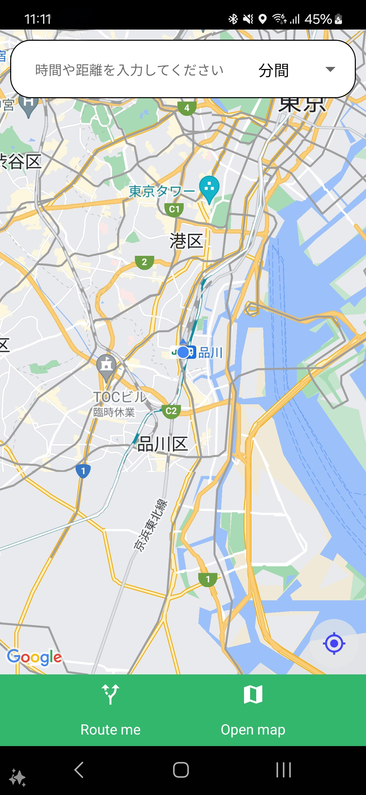
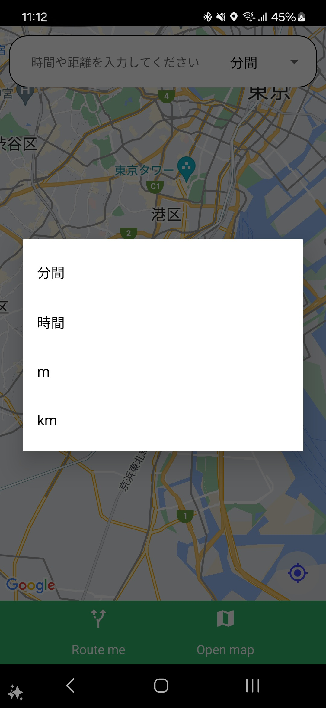
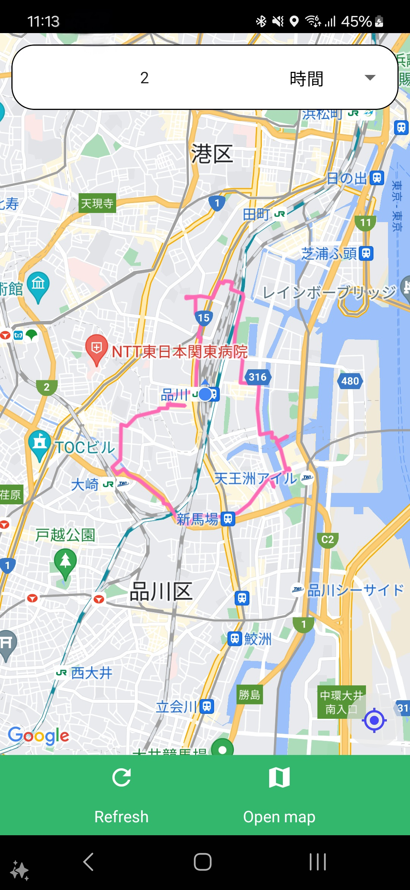

# smart-root
iOS/Android向けアプリ。
現在地点または、任意の地点から巡回ルートを自動生成し提案する機能を有する。

## アプリのダウンロード

[Google Play](https://play.google.com/store/apps/details?id=com.kchihogi.smartroot)

## Features
- ルート生成機能

※画像はAndroid版のものです。一部、画像を加工しています。

## プライバシーポリシー

[privacy.md](privacy.md)

## Skills
- React Native
- Expo
